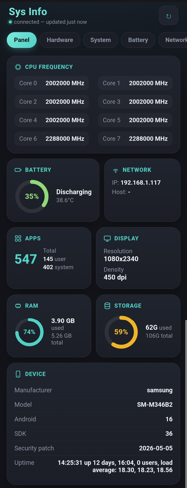
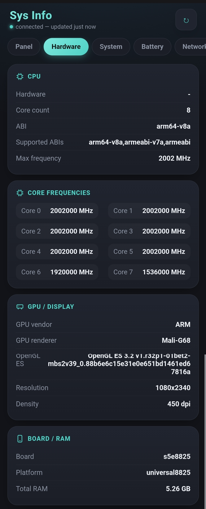
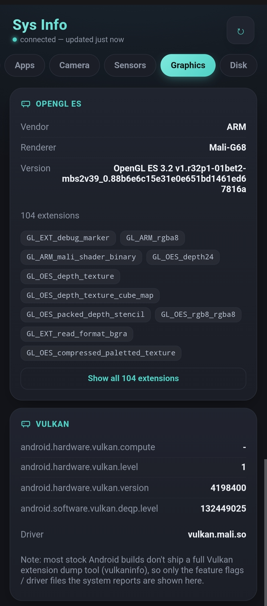

# Sys Info — ADB Module

A lightweight system info dashboard for Shizuku-based ADB module managers — works with [Shevery](https://github.com/HmnDev-Tech/shevery) and Nightzuku. Runs entirely through the Shizuku shell bridge — no root required.

## Screenshots

  
  
  

## Features

- **Panel** — quick overview: CPU frequency, battery, network, apps, display, RAM/storage usage rings
- **Hardware** — CPU (cores, ABI, max frequency), GPU renderer, board/platform, RAM
- **System** — Android version, SDK, build ID, security patch, kernel, fingerprint
- **Battery** — full raw `dumpsys battery` breakdown
- **Network** — IP, hostname, interfaces, WiFi details
- **Graphics** — OpenGL ES vendor/renderer/version, Vulkan feature flags & driver detection
- **Disk** — mounted volumes (`df -h`) and raw `/proc/partitions`

Each tab loads its own data on demand (lazy-loaded), so opening the module doesn't run every command at once.

## Installation

1. Download the latest release ZIP (or clone this repo and zip `module.prop`, `action.sh`, `webui/`, `banner.png`)
2. In Shevery or Nightzuku: **ADB Modules → Install ZIP**
3. Enable the module
4. Set access mode to **Full access** (some `dumpsys` calls need it — Safe mode may return partial data)
5. Open the module card → **WebUI**

## Notes

- Vulkan detection relies on `pm list features` and driver file presence under `/vendor/lib64/hw` / `/system/lib64/hw` — most stock Android builds don't ship a full `vulkaninfo`-style extension dump, so this only shows what the system itself reports.
- Some WiFi/network fields may return empty on Safe mode due to permission restrictions.

## License

This project is licensed under the **GNU General Public License v3.0** — see [LICENSE](LICENSE) for details.

## Author

[HaydarReiss31](https://github.com/HaydarReiss31)
